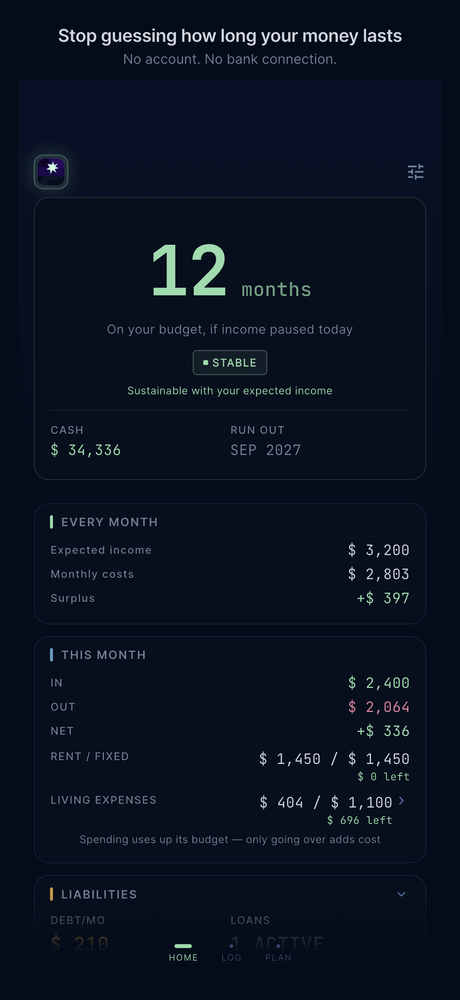
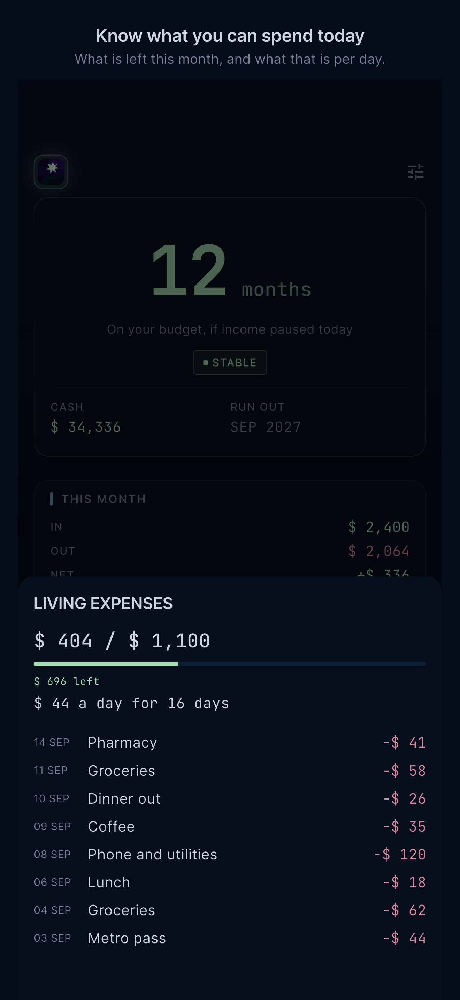
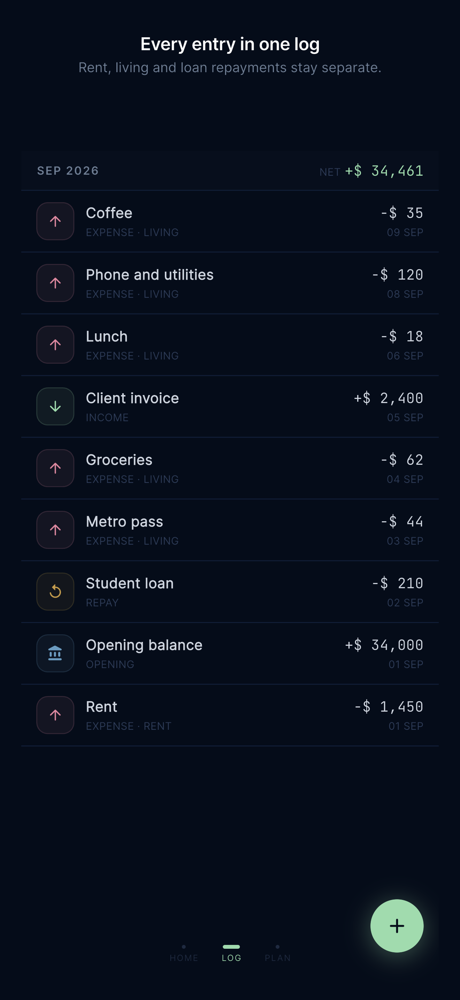
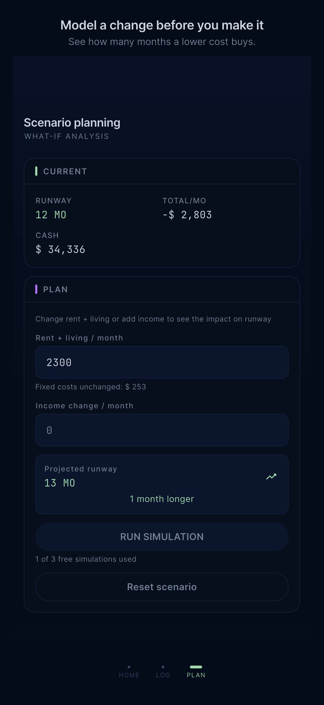

# Financial Runway

One phone. No account, no bank connection.

## How long will your money last?

Most money apps tell you where your money went. This one tells you how long it
lasts: one number, counted from today, and the month it runs out.

It is for a defined chapter rather than for ever — studying abroad, between
jobs, bootstrapping something, living off savings. The question does not change
while you are in one, so neither does the app.

## Screens

<p align="center">
  
  
  
  
</p>

Demo data. The runway reads 12 months because 34,336 in cash against 2,803 a
month is 12.25 — the number is computed, not mocked.

## See it, log it, try it

**Know what you can spend today.** Your monthly living budget becomes one useful
number for today, and what is left after it.

**Speed dial.** Six occasions and an amount. Logging an expense uses up its
budget rather than adding to your costs, so the runway only moves when you go
over.

**See what one change buys you.** Try a lower monthly cost or extra income
against the runway you already have, and read the months it adds. It changes no
records.

## Your money story stays with you

Entries live in a SQLCipher database with the key in the Keychain, so there is
no account to make, no bank to connect and no server to leak. Six languages —
English, Spanish, French, Italian, Japanese and Traditional Chinese — and six
currency symbols: JPY, TWD, USD, EUR, GBP, CNY. The symbol is a display choice;
amounts are never converted.

Delete all data erases every entry, loan, subscription, budget and setting.
The Pro purchase survives it, so clearing your data never costs you what you
paid for.

## Status

**1.0.0 is in App Review.** Build 174 was submitted on 22 September 2026.

No release tag has been cut, so nothing has been published to TestFlight or
Play. The release workflows build signed iOS and Android artefacts when a
release PR merges into `main`.

Pro is wired end to end: a $3.99 one-time purchase through RevenueCat, gating
the sixth entry and the fourth simulation. The free plan allows five entries in
total and three simulations; the opening balance does not count toward the five
and subscriptions are unlimited.

---

## What's next

**Android.** The same number on whatever phone you carry.

Also on the list: one commitment model, so rent, loans and subscriptions stop
being three objects that differ only in a cadence and an end date; the liability
behind a loan and not just its payment; the income half, which today has no
screens at all; and asking about a subscription charge on the day it happens
rather than the next time the app is opened.

---

## Building it

```
packages/
  domain/          Pure Dart. Entities, logic, repository interfaces.
  data/            Drift + SQLCipher. Repository implementations.
  application/     Riverpod providers and use cases.
  design_system/   Tokens, theme, components, localisations.
  presentation/    Screens and widgets.
app/               The Flutter app that wires them together.
```

A Melos workspace. `domain` has no Flutter dependency, which is what keeps the
runway calculation testable without a widget tree.

```bash
make setup        # melos bootstrap
make gen          # Drift and Riverpod codegen
make gen-l10n     # regenerate localisations from the .arb files
make analyze      # every package
make test         # every package
make run          # on a connected device
```

---

*This README says what the app does and how to build it. It deliberately does
not document the architecture in prose: the previous version described a safety
buffer, an investable split and four test classes that no longer existed, and
nobody noticed because nothing fails when a README goes out of date. The code
is the reference.*
