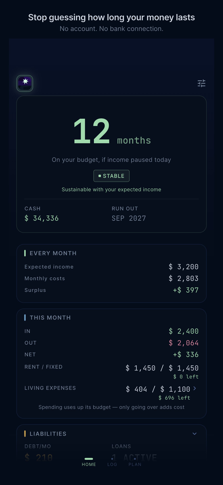
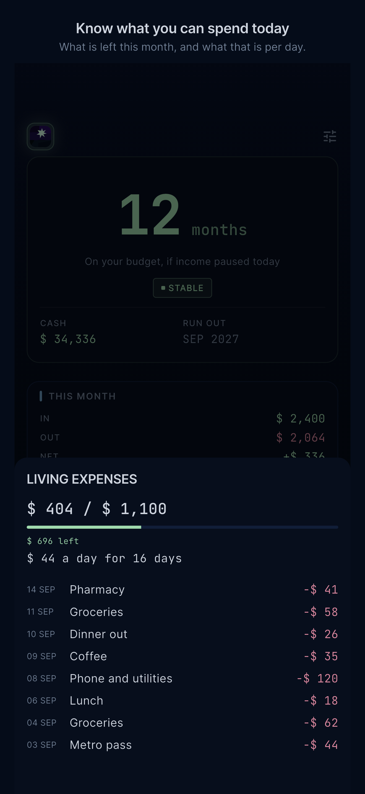
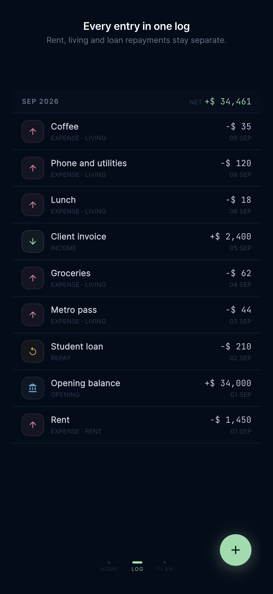
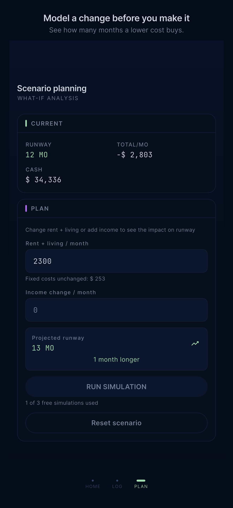

# Financial Runway

### How many months does your money cover?

One number, counted from today, and the month it runs out. No account, no bank
connection, nothing leaves your phone.

[**Try it on TestFlight**](https://testflight.apple.com/join/FjpzWmat) · [App Store](https://apps.apple.com/app/id6778675088)

  
  
  
  

## Most money apps tell you where it went

This one tells you how long it lasts.

It is for a defined chapter rather than for ever: studying abroad, between
jobs, bootstrapping something, living off savings. The question does not change
while you are in one, so neither does the app.

## Three things it does

**Know what you can spend today.** Your monthly living budget becomes one useful
number for today, and what is left after it.

**A tap and a number.** The app asks what it was for and offers six occasions
rather than six categories. Logging an expense uses up its budget rather than
adding to your costs, so the runway moves only when your spending goes past the
budget.

**See what one change buys you.** Try a lower monthly cost or extra income
against the runway you already have, and read the months it adds. It changes no
records.

## Your money never leaves the phone

Entries live in a SQLCipher database with the key in the Keychain. There is no
account to make, no bank to connect and no server to leak.

Six languages, English, Spanish, French, Italian, Japanese and Traditional
Chinese, and six currency symbols: JPY, TWD, USD, EUR, GBP, CNY. The symbol is
a display choice; amounts are never converted.

Delete all data erases every entry, loan, subscription, budget and setting.
Runway Pro is one payment and never a subscription, and it survives the erase,
so clearing your data never costs you what you paid for.

## What's next

**Android.** The same number on whatever phone you carry.

---

Building it: [DEVELOPMENT.md](DEVELOPMENT.md) · Decisions: [CONTRACTS.md](CONTRACTS.md)
